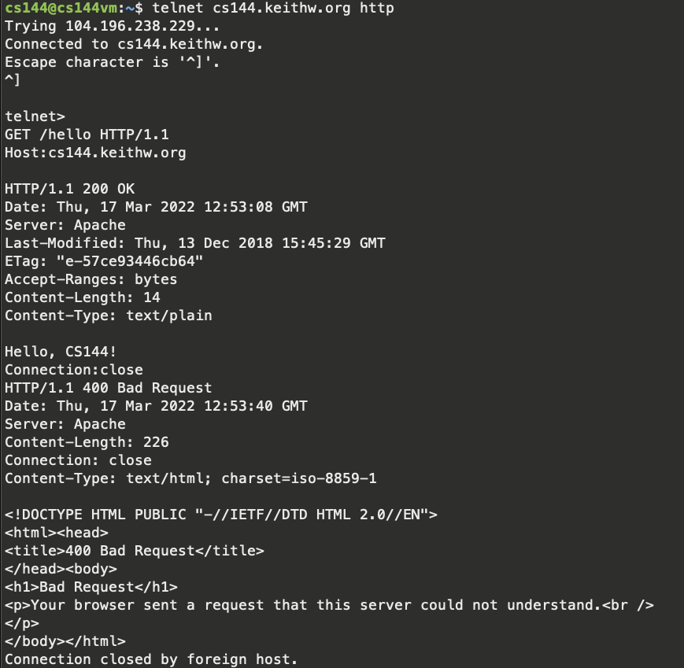
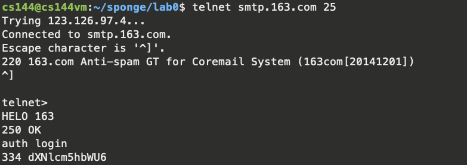
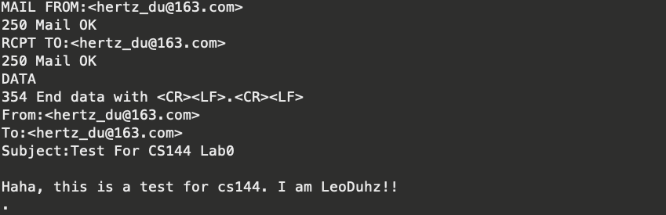
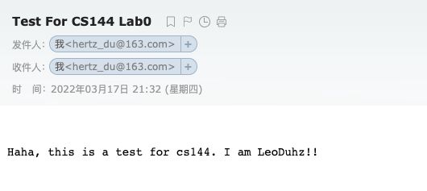

# Lab #0

LeoDuhz

## 2.1 Fetch a Web Page

## 2.2 Send yourself an email

Since I am not a Stanford student(hope one day i will be haha), i only use 163 mail which is once popular in China.

Then i input my mail address and my password for SMTP service both encoded in Base64 format.

(This web is really great:https://www.base64encode.org/)

Check my email:

I made it!!!

## 2.3 Listening and connecting

quite easy, skip

# 3.Writing a network program using an OS stream socket

